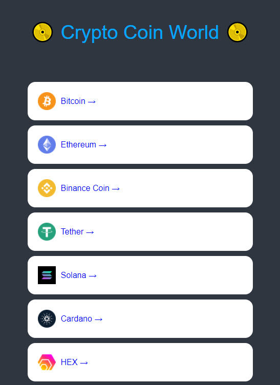
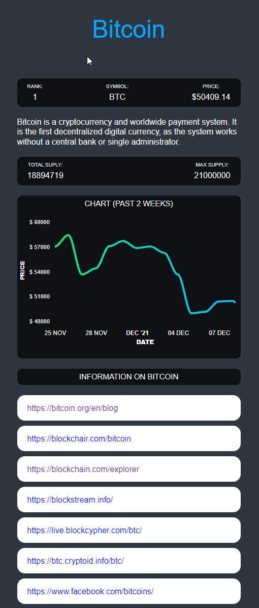

# Crypto World

- This project is to learn how to use ReactJS and TypeScript to create a website that displays up-tp-date information about crypto currency

# Preview

URL: https://sad-williams-8a7777.netlify.app/#/

Home            |  Detail
:-------------------------:|:-------------------------:
 | 


# Plan

1. Install ReactJS with TypeScript
2. Fetch data from coinpaprika API
3. Display data using ReactJS and render an interactive page with styles.

# File structure:

- Home
    - Coin Data


# Dev progress

# 1.0 Install ReactJS with TypeScript template

- On the website https://create-react-app.dev/docs/adding-typescript/, you can install reactJS with TypeScript template by running the below code from the terminal

```js
npx create-react-app my-app --template typescript
```
1. Install react-router-dom and react-query

```js
// install version 5.3.0.
npm i react-router-dom@5.3.0
```

- TypeScript does not know the package called react-router-dom. Therefore, we have to use DefinatelyTyped to state the Types.
```js
npm i --save-dev @types/react-router-dom
```

- Install Switch because it allows to render one route at a time.

Issue: *TypeScript does not recognize ReactJS pacakges*

- In this case you use DefinitelyTyped repository to find matching typed packages and install it. 
```js
// install in terminal
types\styled-components
```

**Current Structure:**

index.tsx > App.tsx > Router.tsx > Pages

src/index.tsx
```ts
import React from "react";
import ReactDOM from "react-dom";
import { ThemeProvider } from "styled-components";
import App from "./App";
import { theme } from "./theme";

ReactDOM.render(
  <React.StrictMode>
    <ThemeProvider theme={theme}>
      <App />
    </ThemeProvider>
  </React.StrictMode>,
  document.getElementById("root")
);
```

src/App.tsx
```ts
import Router from "./Router";

function App() {
  return <Router />;
}

export default App;
```

src/Router.tsx
```ts
import { BrowserRouter, Switch, Route } from "react-router-dom";
import Coin from "./routes/Coin";
import Coins from "./routes/Coins";

function Router() {
  return (
    <BrowserRouter>
      <Switch>
        <Route path="/:coinId">
          <Coin />
        </Route>
        <Route path="/">
          <Coins />
        </Route>
      </Switch>
    </BrowserRouter>
  );
}
export default Router;
```

Additional adjustments:
- Use DefaultTheme to create a global theme. 
- use useParams to get the current URL name
```ts
import { useParams } from "react-router";

interface RouteParams {
  coinId: string;
}

function Coin() {
  const { coinId } = useParams<RouteParams>();
  return <h1>Coin: {coinId}</h1>;
}
export default Coin;
```


2. Use **React Query** to fetch data. 

- React Query allows you to fetch data in much more convenient way. 

3. Reset Style

- Since there are default style applied in ReactJS, it is good to reset CSS using a file called resetCSS. It will take all the HTML tags and set everything to zero. 

- Also, we need to decide where to put the Global style that gets applied to the whole website. 

Steps:

1. Create a global style.
2. Apply to resetCSS so that everything turns to 0 default.

1. Use createGlobalStyle to create a GlobalStyle.
src/app.tsx:
```js
import { createGlobalStyle } from "styled-components";
import Router from "./Router";

const GlobalStyle = createGlobalStyle`
@import url('https://fonts.googleapis.com/css2?family=Source+Sans+Pro:wght@300;400&display=swap');
html, body, div, span, applet, object, iframe,
h1, h2, h3, h4, h5, h6, p, blockquote, pre,
a, abbr, acronym, address, big, cite, code,
del, dfn, em, img, ins, kbd, q, s, samp,
small, strike, strong, sub, sup, tt, var,
b, u, i, center,
dl, dt, dd, menu, ol, ul, li,
fieldset, form, label, legend,
table, caption, tbody, tfoot, thead, tr, th, td,
article, aside, canvas, details, embed,
figure, figcaption, footer, header, hgroup,
main, menu, nav, output, ruby, section, summary,
time, mark, audio, video {
  margin: 0;
  padding: 0;
  border: 0;
  font-size: 100%;
  font: inherit;
  vertical-align: baseline;
}
/* HTML5 display-role reset for older browsers */
article, aside, details, figcaption, figure,
footer, header, hgroup, main, menu, nav, section {
  display: block;
}
/* HTML5 hidden-attribute fix for newer browsers */
*[hidden] {
    display: none;
}
body {
  line-height: 1;
}
menu, ol, ul {
  list-style: none;
}
blockquote, q {
  quotes: none;
}
blockquote:before, blockquote:after,
q:before, q:after {
  content: '';
  content: none;
}
table {
  border-collapse: collapse;
  border-spacing: 0;
}
* {
  box-sizing: border-box;
}
body {
  font-family: 'Source Sans Pro', sans-serif;
  background-color:${(props) => props.theme.bgColor};
  color:${(props) => props.theme.textColor}
}
a {
  text-decoration:none;
}
`;

// Use fragments when you are returning JSX.
function App() {
  return (
    <>
      <GlobalStyle />
      <Router />
    </>
  );
}

export default App;
```

*What is happening in the code snippet?*

1. Reset CSS. 
2. Set the global font in body{}
3. Get the background color and font color from the theme. (App has access to the theme provider.)

*Create the declaration file.*

styled.d.ts: will create an interface for the default theme. 

# 2.0. Create Styles 

- Now that you have styled-components installed, you can set the styles for each component.

1. Create list of coin list components. 

- similar to how you structure your code around HTML, you have to first create components and arrange them. Then, you set the style. 

Steps:

1. Create styled Components. 
2. Create to-be-returned JSX.
3. Create an empty data holder to test.
4. Create a link to the detailed coint page. 

Homecoin.tsx

1. Create styled components.

```ts
const Container = styled.div``;
const Header = styled.header``;
const CoinsList = styled.ul``;
const Coin = styled.li``;
const Title = styled.h1`
  color: ${(props) => props.theme.accentColor};
`;

```

2. Create JSX:

```js
function HomeCoin(){
  return (
    <Container>
      <Header>
        <Title>Crypto Coin</Title>
      </Header>
      <CoinsList>
        {coins.map((coin) => (
          <Coin key={coin.id}>
            <Link to={`/${coin.id}`}>{coin.name} &rarr;</Link>
          </Coin>
        ))}
      </CoinsList>
    </Container>
  );
}

export default HomeCoin;


```

3. Create data to test

```ts
// part of data that is returned from API.
const coins = [
  {
    id: "btc-bitcoin",
    name: "Bitcoin",
    symbol: "BTC",
    rank: 1,
    is_new: false,
    is_active: true,
    type: "coin",
  },
  {
    id: "eth-ethereum",
    name: "Ethereum",
    symbol: "ETH",
    rank: 2,
    is_new: false,
    is_active: true,
    type: "coin",
  },
  {
    id: "hex-hex",
    name: "HEX",
    symbol: "HEX",
    rank: 3,
    is_new: false,
    is_active: true,
    type: "token",
  },
];
```

4. Create a Link

- You can create a link by using a component called Link from the "react-router-dom" package. 

- Disable an ugly link by setting up the global css. You won't create a new style when the mouse is hovered but it will inherit father's color. 


# 2.0 Fetch Data from coinpaprika API.

- Coin paprika offers like 4000 cryptocurrency information Therefore, we need to fetch and clean data. 

Steps:


1. Make an interface of data because TypeScript wants to know how the data look like. 

Homecoin.tsx
```ts
interface CoinInterface {
  id: string;
  name: string;
  symbol: string;
  rank: number;
  is_new: boolean;
  is_active: boolean;
  type: string;
}
```

2. Tell the TypeScript how the Coin is going to be look like. 

a. Put the coin in the state. 
```ts
// Create a state and the data is going to look like a CoinInterface.
const [coins, setCoins] = useState<CoinInterface[]>([]);
```

b. Use useEffect to fetch data once page is loaded. 

**useEffect**: to execute code in certain periods of time. You can choose to run in the beginning of the code or the end of the life component. 

```ts

// useEffect will happen in the beginning of the component life because there is [].
// async and effect can be used inside the useEffect. You can make the async() execute immediately.
useEffect(()=>{
    (async()=> {

    })
    fetch("https://api.coinpaprika.com/v1/coins)
}, [])

```

*Tip: How do you make the async() run immediately?*

- The below trick will make the async() run immediately. 
option 1:
```ts
(async()=> {
    fetch(<url>)
})();

```
format:
```ts
(() => console.log.log(1))();
```

Final product:
```ts

  // fetching the data from the API.
  useEffect(() => {
    (async () => {
      const response = await fetch("https://api.coinpaprika.com/v1/coins");
      const json = await response.json();
      // 4000 API returns are reduced to 100 and setState.
      setCoins(json.slice(0, 100));
      setLoading(false);
    })();
  }, []);
```

c. Create a loading state.

- Once the data is loaded, we are going to set the loading is set to be false. 


*How do you write a comment within the render method in reactJS?*

```ts
{/* put comments here*/}
```

- Create a loading state using useState() function.

```ts
const [loading, setLoading] = useState(true);
 {loading ? (
        <Loader>Loading...</Loader>
      ) : (
        <CoinList></CoinList>
      )}
```

d. display data and icons. 

- You can display data using the return or render() method in reactjs. 
- Also, you can display icons by getting icons from Crypto Icon API. 

API link:
api.vercel.app/api/icon/<coinname in lowercase>

- Create a Img components to resize the image.
```js
// Img styled component
const Img = styled.img`
  width: 35px;
  height: 35px;
  margin-right: 10px;
`;


<Link
to={{
    pathname: `/${coin.id}`,
    state: { name: coin.name },
}}
>

{coin.name} &rarr;
</Link>
```

- Make sure that the Link and the Img are center

```css
display: flex;
align-items: center;
```

- Send information to the detailed page. This is efficient because you don't have to request for information twice.

*How do you send props between pages?*

- You can send props via <Link to="">
```js
// As soon as the Link is clicked, it will start sending information to the other screen. 
<Link
to={{
    pathname: `/${coin.id}`,
    state: { name: coin.name },
}}

```

- If you send the data, the other side can retrieve data by using useLocation method from react-router-dom package. 

```js
// state will contain the object that gets sent through state.
  const { state } = useLocation<RouteState>();
```

- You have to create the RouteState Interface to communicate to the TypeScript.

**Warning: The downside of this is that it won't render if the use goes directly to the page.**

# 2.1 Create Coin detail page

- We hit two URL (Coin - information and ticker - price)
URLS:
https://api.coinpaprika.com/v1/coins/
https://api.coinpaprika.com/v1/tickers/

Steps:

1. Create the useState() for each hits
2. Create useEffect so that API will be requested when the page render
  - we want to render immediately.
3. After we retrieve data, we update the state for each hits. 
4. Create an interface to explain what we data are we getting. 
  - Set as global variable
  - Use Objects.key to get all the keys.
  - Do the object.keys(temp1).join so that you will get the list of all the keys seperated by comma. 
  - CNTR-D till the end to select all commas. 
  - Then, press enter. 
  - CTRL-SHFT-L and put move all the cursor to the end.
  - Do the same for the values.
  - just use the interface creator on the website: 
  https://app.quicktype.io/?l=ts


# 2.2 Explain Data Type to TypeScript. 

Steps:

1. Create infoData and priceData states. 
2. Create an interface of data coming in from API.
3. Save the data after retrieving data from API. 

Coin.tsx
```js
interface InfoData {
  id: string;
  name: string;
  symbol: string;
  rank: number;
  is_new: boolean;
  is_active: boolean;
  type: string;
  description: string;
  message: string;
  open_source: boolean;
  started_at: string;
  development_status: string;
  hardware_wallet: boolean;
  proof_type: string;
  org_structure: string;
  hash_algorithm: string;
  first_data_at: string;
  last_data_at: string;
}

interface PriceData {
  id: string;
  name: string;
  symbol: string;
  rank: number;
  circulating_supply: number;
  total_supply: number;
  max_supply: number;
  beta_value: number;
  first_data_at: string;
  last_updated: string;
  quotes: {
    USD: {
      ath_date: string;
      ath_price: number;
      market_cap: number;
      market_cap_change_24h: number;
      percent_change_1h: number;
      percent_change_1y: number;
      percent_change_6h: number;
      percent_change_7d: number;
      percent_change_12h: number;
      percent_change_15m: number;
      percent_change_24h: number;
      percent_change_30d: number;
      percent_change_30m: number;
      percent_from_price_ath: number;
      price: number;
      volume_24h: number;
      volume_24h_change_24h: number;
    };
  };
}

```

*Whatever you use as a hook, you have to put the put the [coinID] as a dependency as below*

- useRouteMatch will tell you whether you are in a specific URL or not. 
- if you console.log the useRouteMatch, you get an object of the path if you are inside the specified url. 
- 